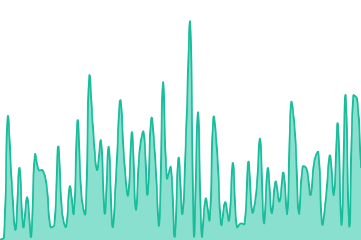
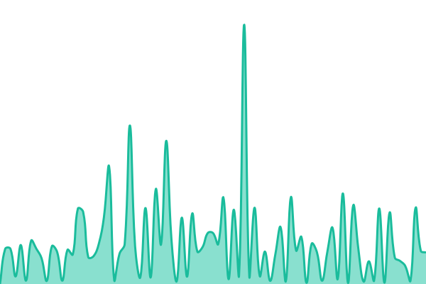

# [📈 Live Status](https://maksimus12.github.io/me-upptime): <!--live status--> **🟩 All systems operational**

This repository contains the open-source uptime monitor and status page for [Maxim Diacenko](https://maksimus12.github.io/me-upptime), powered by [Upptime](https://github.com/upptime/upptime).

With [Upptime](https://upptime.js.org), you can get your own unlimited and free uptime monitor and status page, powered entirely by a GitHub repository. We use [Issues](https://github.com/maksimus12/me-upptime/issues) as incident reports, [Actions](https://github.com/maksimus12/me-upptime/actions) as uptime monitors, and [Pages](https://maksimus12.github.io/me-upptime) for the status page.

<!--start: status pages-->
<!-- This summary is generated by Upptime (https://github.com/upptime/upptime) -->
<!-- Do not edit this manually, your changes will be overwritten -->
<!-- prettier-ignore -->
| URL | Status | History | Response Time | Uptime |
| --- | ------ | ------- | ------------- | ------ |
|  [Mission Eurasia Field](https://missioneurasiafield.org/) | 🟩 Up | [mission-eurasia-field.yml](https://github.com/maksimus12/me-upptime/commits/HEAD/history/mission-eurasia-field.yml) | 

 699ms
     
 | 

<a href="https://maksimus12.github.io/me-upptime/history/mission-eurasia-field">93.58%</a>
    

|  [Mission in Profession (Landing)](https://pro.missioneurasiafield.org/) | 🟩 Up | [mission-in-profession-landing.yml](https://github.com/maksimus12/me-upptime/commits/HEAD/history/mission-in-profession-landing.yml) | 

 0ms
     
 | 

<a href="https://maksimus12.github.io/me-upptime/history/mission-in-profession-landing">93.57%</a>
    

|  [Empower (Landing)](https://empower.missioneurasiafield.org/) | 🟩 Up | [empower-landing.yml](https://github.com/maksimus12/me-upptime/commits/HEAD/history/empower-landing.yml) | 

 527ms
     
 | 

<a href="https://maksimus12.github.io/me-upptime/history/empower-landing">93.57%</a>
    

<!--end: status pages-->

[**Visit our status website →**](https://maksimus12.github.io/me-upptime)

## 📄 License

- Powered by: [Upptime](https://github.com/upptime/upptime)
- Code: [MIT](./LICENSE) © [Anand Chowdhary](https://anandchowdhary.com), supported by [Pabio](https://pabio.com)
- Data in the `./history` directory: [Open Database License](https://opendatacommons.org/licenses/odbl/1-0/)
